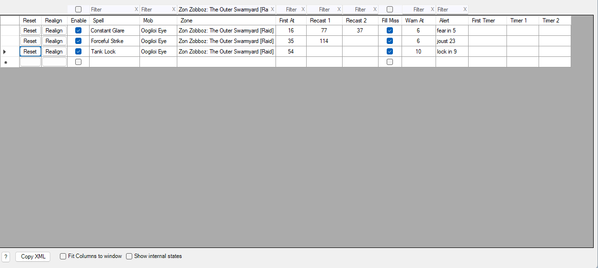
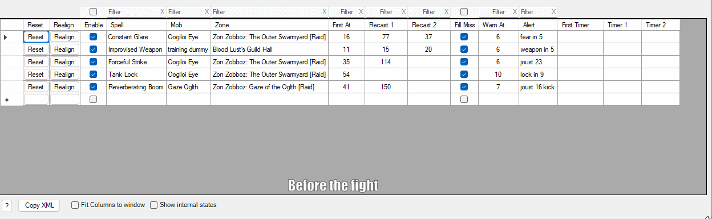

# Chained Timers Plugin

This plugin adds another spell timer method to Advanced Combat Tracker. The plugin does not replicate all of the capabilites of native spell timers. The plugin provides the following new capatilties:
* Start a timer when the fight starts and generate an alert a specified number of seconds after the fight starts (i.e. to warn of the very first occurrence of the spell).
* Handle the case where the mob casts the spell with two different, alternating, recast times.
* Handle the case where the spell does not hit anyone but the timer still needs to restart. For example, if it's a joust call and everyone jousted so the spell did not hit anyone. (Note that the plugin timer can drift from the game timer when actual occurrences are not observed for realignment.)
* Timers are stopped when ACT determines that combat has stopped.

Spell data is entered by the user in the data grid. The spell name is required. 

If the 'Mob' name is entered, the spell only triggers for fights with that mob. 

If the 'Zone' name is entered, the spell only triggers in that zone.

## Grid Fields
The meaning and usage of the grid cells is described below.
* __Reset__ - This button resets the state of the timer. It will then act as if the fight has not yet started.
* __Realign__ - This button will set the timer to wait for an occurrence of the spell and start _Timer 1_ when the spell is detected.
* __Enable__ - Spells must be enabled for the plugin to monitor them.
* __Spell__ - The exact name of the spell to monitor.
* __Mob__ - (Optional) The exact name of the mob that casts the spell. The plugin uses the mob name to determine when the fight starts. If the mob name is specified, the plugin must detect that mob is in combat before starting the timer(s). The _First Timer_ does not function without a specified _Mob_ name.
* __Zone__ - (Optional) The zone where the spell occurs. If left blank, the spell will be available for monitoring in any zone (depending on the _Mob_ and _Enable_ settings). Otherwise, the zone entry needs to "match" the zone where the spell should be monitored. Since the _Zone_ filter uses partial matches, this does not need to be an exact match to the zone name.
* __First At__ - (Optional) The number of seconds after the fight starts that the first occurrence of the _Spell_ is expected. The _Mob_ name must be specified for the plugin to detect the start of the fight.
* __Recast 1__ - (Optional) The recast time of the spell. Optional in the case where only the _First At_ timer is used. Otherwise, this is the equivalent of the native ACT spell timer time period.
* __Recast 2__ - (Optional) In the case where the mob uses two different alternating recast times, this is the second one. This is only functional if _Recast 1_ is also specified.
* __Fill Miss__ - When checked, the plugin will assume a spell was casted at the time the timer expired even if the actual spell hit was not detected. When unchecked, timers only restart when the plugin sees the spell actuallly land. If using both _Recast 1_ and _Recast 2_ with _Fill Miss_ disabled, spell hits must be detected within plus or minus _Warn At_ seconds of the expected times or the sequencing will break.
* __Warn At__ - This setting serves several purposes:
    * When a countdown timer reaches this count, the _Alert_ is sounded.
	* This also serves as a "window" around the expected timeout.
		* Once a timer counts down to this many seconds or fewer, a detected spell hit will stop the current timer and start the next one.
		* When _Fill Miss_ is enabled and a timer is automatically started after missing a detection, the spell actually hitting within this many seconds will restart the automatically started timer.
* __Alert__ - When a timer counts down to the _Warn At_ time, the plugin sends this phrase to the text-to-speech engine.
* __First Timer__ - Time remaining for the _First At_ timer.
* __Timer 1__ - Time remaining for the _Recast 1_ timer.
* __Timer 2__ - Time remaining for the _Recast 2_ timer.

Other cells that are used by the plugin but cannot be edited by the user can be displayed by checking the _Show internal states_ checkbox at the bottom. Watching these may be useful when debugging timer settings.

## Demo GIF
The GIF below is contrived to demonstrate how the timers work by monitoring a player-casted spell on a training dummy. The GIF starts at the __Before the fight__ annotation when all 5 timers are listed. Starting from the beginning, the actions that the demo reflects are as follows:
1. The player starts the fight by hitting the training dummy.
	* The plugin sets the _Enable_ and _Zone_ filters to only show active timers.
	* The _First Timer_ starts counting down beginning at _First At_ seconds.
	* When the _First Timer_ reaches _Warn At_ seconds, the _Alert_ is sounded.
2. The player uses the monitored spell when the _First Timer_ is about to expire.
	* The _First Timer_ clears
    * _Timer 1_ starts counting down beginning at _Recast 1_ seconds.
	* When _Timer 1_ reaches _Warn At_ seconds, the _Alert_ is sounded.
3. The player uses the monitored spell when _Timer 1_ is about to expire.
	* _Timer 1_ is cleared.
    * _Timer 2_ starts counting down beginning at _Recast 2_ seconds.
	* When _Timer 2_ reaches _Warn At_ seconds, the _Alert_ is sounded.
4. The third occurrence of the spell is not casted on time, _Timer 2_ times out. Since the _Fill Miss_ option is enabled:
	* _Timer 1_ starts anyway.
	* _Timer 2_ shows red background negative numbers showing how late the spell cast is.
5. When the third spell occurrence is 4 seconds late (the _Timer 2_ red counter is -4, i.e. within the _Warn At_ window), the player casts the monitored spell.
	* _Timer 2_ is cleared.
    * _Timer 1_ is restarted at _Recast 1_ seconds.
    * When _Timer 1_ reaches _Warn At_ seconds, the _Alert_ is sounded.
6. The player does not cast the spell again and eventually ends combat.
     * When _Timer 1_ reaches _Warn At_ seconds, the _Alert_ is sounded.
	* When _Timer 1_ expires, _Timer 2_ automatically starts since _Fill Miss_ is enabled.
	* When _Timer 2_ reaches _Warn At_ seconds, the _Alert_ is sounded.
    * When _Timer 2_ expires, _Timer 1_ automtically starts since _Fill Miss_ is enabled.
	* Combat ends.
7. When combat ends, all timers are stopped, the _Enable_ and _Zone_ filters are cleared, and the entire spell list is displayed.

## Create a timer from an encounter
The easiest way to populate the 'Spell', 'Mob', and 'Zone' fields is to use an encounter with the mob from the ACT 'Main' tab. 
1. In the encounter list on the ACT 'Main' tab, select the spell to monitor under the *Outgoing Damage* for the mob.
2. Then check the 'Enable' checkbox on the empty row of the ChainTimers plugin to start a new row.
3. Then right-click the 'Spell' cell of the new row and choose the _Copy Spell from Main tab_ menu.
4. If desired, restrict the timer to the encounter mob by right-clicking the 'Mob' cell of the new row and choosing the _Copy Mob from Main tab_ menu.  The mob name is required for the _First At_ timer to work.
5. If desired, restrict the timer to the encounter zone by right-clicking the 'Zone' cell of the new row and choosing the _Copy Zone from Main tab_ menu.

Cells can also be hand edited.
Note that it can be hard for the user to change values on a line with an active timer because the code is also accessing the data.
## Filters
Filter boxes are available above each user-entered field in the spell list. Entering a filter changes the list of displayed spells to only those that match the filter(s).

In general, filters are available to help find timer(s) once the spell list gets long, for instance to change a setting or to share timers for a particular zone. However, the plugin uses the _Zone_ filter as described in the [active timers](#active-timers) section.

Text field filters are not case sensitive.

Text field filters use partial matches. For example, entering a 'c' in the 'Spell' filter will filter the list to only spells that have a letter 'c' anywhere in them. Continuing to type the spell name will further limit the results list.

Number fields use exact matches by default. For example, entering a '4' in the filter box will list only spells whose setting is exactly 4. Typing a second digit, for example '5', will list spells whose setting is exactly '45'.

Number fields also support one comparison action. Two or more conditions (e.g. _>35 AND <75_) is not suppored. Supported filters are as follows:
* __=__ which is the same as the default operation - the number must match exactly
* __>__ matches numbers that are greater than the given number. For example '>35' matches spells whose field is 36 or above.
* __>=__ matches numbers that are greater than or equal to the given number. For example '>=35' matches spells whose field is 35 or above.
* __<__ matches numbers that are less than the given number. For example '<35' matches spells whose field is 34 or below.
* __<=__ matches numbers that are less than or equal to the given number. For example '<=35' matches spells whose field is 35 or below.
* __<>__ matches numbers that are not the given number. For example '<>35' matches spells whose field is anything other than 35.

## Active Timers
To minimize CPU load, the plugin only monitors for spells that are currently displayed in the spell list. It automatically sets the _Zone_ and _Enable_ filters to distinguish spells to monitor.

If the user has further filtered the list by entering any other filter criteria, the plugin only watches for the resulting filtered spells.

When the user starts combat in the game
* the plugin automatically sets the _Zone_ filter to display and process only the spells whose zone name matches the current zone, or whose zone name is empty (i.e. set to match any zone).
* the plugin sets the _Enable_ filter to only display and process enabled spells

When combat ends, the _Enable_ and _Zone_ filters are automatically cleared.

## Sharing
Timers can be shared with other plugin users by:
* selecting the row(s) in the data grid
* pressing the `[Copy XML]` button

If a single row is selected when the `[Copy XML]` button is pressed, paste the shared timer into the game by clicking a chat box, adding a game chat channel like `/r `, and pressing `Ctrl-v` `Return`.

If multiple rows are selected when the `[Copy XML]` button is pressed, the dialog for sharing the timers via macro(s) opens. In the share dialog, pressing the `[Macro]` button copies the selected `do_file_commands` line for pasting in a game chat channel using `Ctrl-v` `Return`.

## Installation
The easiest way to install the plugin is to use the [Get Plugins...] button in ACT. The button is located on the [Plugins]->[Plugin Listing] tab near the upper right corner. Select the `(101) Chained Timers` entry and press the [Download and Enable] button.

Otherwise, the plugin must be manually downloaded and installed. 
* Download the `ChainTimers.dll` file from the Releases page. 
* Install the downloaded file in ACT.
  * On the ACT [Plugin Listing] page, use the [Browse..] button to browse to the location where you downloaded the `ChainTimers.dll` file and select it. Then use the [Add/Enable Plugin] button.
  * You will likely need to tell Windows to trust the downloaded file.

